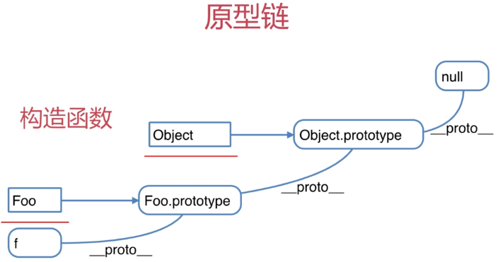
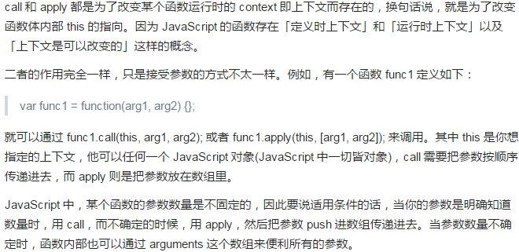

# 1. 几道面试题
## 1. JS中的typeof能得到哪些类型？

个人答案： number、string、boolean、object、function

缺少答案: undefined、null    //有**错误答案**，正确答案在下方查找

## 2. 何时使用 == ？何时使用 ===？
答案： 不在意类型转换的时候，可以使用==，在意强制类型转换的时候必须使用===，例如从api接口接收到的状态码。
```
if(obj.a == null){
  // 这里相当于 obj.a === null || obj.a === undefined 的简写形式，其余建议都采用 === 形式。
  // jQuery源码中的推荐写法，判断一个对象的属性是否存在的时候，或者在函数中a参数是否存在的情况。
}
```

## 3. JS 内置函数
答案： Number、String、Boolean、Array、Object、Function、Date、RegExp、Error

## 4. JS变量按照存储方式区分为哪些类型？并描述其特点
答案：值类型 和 引用类型。值类型的变量是分块存储**互不影响**，引用类型是指针存储，指向同一块存储数据。

## 5. 如何理解JSON
答案：JSON只不过是一个JS中对象而已,在其他语法中其是一个数据格式
JSON.stringify({a:10,b:20});
JSON.parse('{"a":10,"b":20}');

# 2. 变量类型
## 1. 值类型
```
var a = 100;
var b = a;
a = 200;
console.log(b,a); // b -> 100 , a -> 200 
```

## 2. 引用类型 - 对象、数组、函数
```
var a = {age:20};
var b = a;
b.age = 21;
console.log(a.age); // 21
// 变量a 是指针指向一个存储位置，变量b是创建的一个新的指针，两变量同时指向一个存储位置，所以 a.age -> 21;
```
此项原因，先说到引用类型特点：可以无限添加属性（age、sex等等等）。属性多之后，如果变量b又是直接新的对象，占用存储空间无限大，这是不合理的，顾有以上限制。

## 3. typeof
```
typeof undefined  // undefined
typeof 'abc'      // string
typeof 1          // number
typeof true       // boolean
typeof {}         // object
typeof []         // object
typeof null       // object,特殊
typeof console.log // function
```

## 4. 强制类型转换

以下为会发生强制类型转换的场景
- 字符串拼接
```
var a = 100 + 10;   // 110
var b = 100 + '10'; // 10010
```
- == 两等号
```
100 == '100';      // true
0 == '';           // true
null == undefined; // true
0 == false;         // true
0 == null;         // false
0 == undefined;    // false
-1 == false;       // false
```
- if语句
```
var a = true;
if(a) console.log(a);  // true

var b = 100;
if(b) console.log(b);  // 100

var c = '';
if(c) console.log(c);  // 不输出

var d = '0';
if(d) console.log(d);  // 0

var f = 'null';
if(f) console.log(f)   // null
```
- 逻辑运算
```
console.log(10 && 0)     // 0, 0被转换为false

console.log('abc' || '') // abc,''被转换为false

console.log(!window.abc) // true,window.abc = undefined,经过非转换(!)就变为true;window.abc为进行定义

// 判断一个变量被当做true 还是false
var a = 100;
console.log(!!a);  // true,非强制转换为boolean后再取反。
```

# 3. 原型和原型链

## 1. 构造函数
一般函数名开头首字母为大写的函数即为构造函数，符合书写规则。
```
function Foo(name, age) {
  this.name = name;
  this.age = age;
  this.class = 'class-1';
  // return this;  //默认有这行
}

var f = new Foo('ZhangSan',20);
// var f1 = new Foo('LiSi',30); //创建多个对象

// 构造函数执行原理：this先变成空对象，然后一一赋值，最后在返回this对象；
```

## 2. 构造函数扩展
```
var a = {} 其实是 var a = new Object()的语法糖;
var a = [] 其实是 var a = new Array()的语法糖;
function a(){...} 其实是 var a = new Function();
使用instanceof判断一个函数是否是一个变量的构造函数；
```

## 3. 构造函数和普通函数的区别
- 用new创建调用构造函数是创建一个新对象
- this指向，构造函数this被绑定到新创建的对象实例上
- 命名方式，构造函数首字母需大写

## 4. 原型规则 - 5条
- 所有引用类型（对象、数组、函数），都具有对象特性，即可自由扩展属性（除了null以外）
- 所有引用类型（对象、数组、函数），都有一个 \_\_proto__ 属性，属性值是一个普通的对象，俗称*隐式原型*
- 所有的**函数**，都有一个prototype属性，属性值也是一个普通的对象,俗称*显示原型*
- 所有的引用类型（对象、数组、函数），\_\_proto__属性值指向它的构造函数的“prototype”属性值
```
var obj = {}; obj.a = 100;
var arr = []; arr.a = 100;
function fn(){}; fn.a = 100;

console.log(obj.a, arr.a, fn.a);
console.log(obj.__proto__); 
console.log(arr.__proto__); 
console.log(fn.__proto__); 

console.log(fn.prototype);

console.log(obj.__proto__ === Object.prototype);  // true
// obj 为 var obj = New Object 创建的对象，Object也是一个函数，所以有prototype属性
```

- 当试图得到一个对象的属性值时，如果这个对象本身没有这个属性，那么会去它的\_\_proto__（即它的构造函数中的prototype）中寻找。

```
function Foo(name, age) {
  this.name = name;
}

Foo.prototype.alertName = function() {
  alert(this.name);  //this指向实例
}

//创建一个实例
var f = new Foo('LiSi',30);

f.printName = function() {
  console.log(this.name);  //this指向实例
}

//测试
f.printName();
f.alertName();  // 会从原型中寻找属性。
f.toString();   // 要去 f.__proto__.__proto__中寻找

//解释：f、Foo自身属性中不包含toString；根据第5条规则到构造函数原型链中查找，FOO.__proto__ 也不包含toString,但是根据第4条规则__proto__属性是一个对象，也就是还可以查找到对象的构造函数Object，然后在查找到Object函数的__proto__属性，找到toString(查看下图);

//循环对象自身的属性
var item;
for(item in f) {
  // 高级浏览器已经在 for in 循环中屏蔽了来自原型的属性
  // 在这里建议加上这个判断，保证程序健壮性
  // hasOwnProperty()函数用于指示一个对象自身(不包括原型链)是否具有指定名称的属性。如果有，返回true，否则返回false。
  if(f.hasOwnProperty(item)) {
    console.log(item);
  }
}
```
**特殊，Object的prototype的__proto__为null，防止死循环**


## 5. instanceof 判断
```
// 代码接上
// f instanceof Foo的判断逻辑：f的__proto__一层一层的往上判断,能否对应到FOO.prototype

f instanceof Foo // true
f instanceof Object // true
f instanceof Function // false;
Foo instanceof Function // true
f instanceof null // 报错

var a = [];
var b = {};
a instanceof Array; //true
b instanceof Object; //true
```

## 6. 题目
### 1. 如何判断一个变量是数组类型
答案：使用 instanceof 方法

### 2. 写一个原型链继承的例子
答案
```
funciton Animal() {
  this.eat = function() {
    console.log('Animal eat');
  }
}

function Dog() {
  this.bark = function() {    // bark ,狗叫
    console.log('Dog bark')
  }
}

Dog.prototype = new Animal();
//哈士奇
var HaShiQi = new Dog();

HaShiQi.eat(); // Animal eat;通过原型链查找到eat属性
```


### 3. 描述new对象的过程
答案：<br/> 
1.创造一个新对象<br/> 
2.this指向这个对象<br/> 
3.执行代码，对this一一赋值<br/> 
4.return this

### 4. zepto（或者类似框架）源码中如何使用原型链？


# 4. 作用域和闭包

## 1. 执行上下文
关键词： 先执行后定义<br/>
范围：一段\<script\>内 或者 一个函数 <br/>
全局：变量定义、函数声明   // 一段\<script\><br/>
函数: 变量定义、函数声明、this、arguments // 函数<br/>

执行之前先把以上东西拿出来

P.S：注意函数声明和函数表达式的区别
```
function a() {...}  //函数声明

var a = function(){...} //函数表达式
```
实例
```
console.log(a);   // 变量提升，执行此之前，a变量会先拿到最前，但因为第16行未执行赋值，所以此时a = undefined.

var a = 100;      // 如果用let 定义， 上面代码会报错，而不是undefined

fn('LiSi');       // fn函数已经被拿到最前。
function fn(name) {
  age = 20;       // age为何不是undefined，因为age已经被拿到函数最前，然后进行赋值，再进行输出。
  console.log(name, age);
  var age;
}
```

## 2. this
关键: this要在执行时才能确认值,定义时无法确认
```
var obj = {
  name: "A",
  fn: function() {
    console.log(this.name);
  }
}

//  注意 
console.log(this);        // window

obj.fn();                 // this.name == A; this -> obj

obj.fn.call({name:'B'});  // this.name == B; this -> {name:"B"}

var fn1 = obj.fn();       // this -> window;
fn1();

// call 和 apply 为了改变某个函数运行时的 context 即上下文而存在的，换句话说，就是为了改变函数体内部 this 的指向
```


## 3. this使用场景
- 作为构造函数执行，this指向new创建的实例上
- 作为对象属性执行，this指向对象，如上obj
- 作为普通函数执行，this指向window，如上fn1
- call apply bind
```
function fn1(name,age) {
  console.log(name, age);
  console.log(this);
}

fn1.call({x:100},'LiSi',20); // this -> {x:100}
fn1.apply({x:100},['LiSi',20]) // 区别在参数用数组包裹

var fn2 = function (name,age) {
  console.log(name, age);
  console.log(this);
}.bind({x:100});  // bind一定要使用函数表达式才能绑定，不能用函数声明式

fn2('LiSi',20);  // this -> {x:100}
```

## 4. 作用域
- JS没有块级作用域
- 只有函数和全局作用域
```
// 无块级作用域
  if(true) {              //块
    var name = 'LiSi';    //let,也不会进行报错
  }
  console.log(name)   //不报错，可输出，表示无块级作用域

// 全局和函数作用域
var a = 100;
function fn() {
  var a = 200;
  console.log('fn',a);
}
console.log('global',a);
fn();
```

## 5. 作用域链
- 自由变量，是到定义的作用域中查找，而不是到执行的作用域中查找
```
var a = 100;
function fn() {
  var b = 200;

  // 当前作用域没有定义的变量，称其为“自由变量”，会从父级作用域中查找
  console.log(a);

  console.log(b);
  
  a = 300;
}
console.log(a); // 100
fn();           // 100 200
console.log(a); // 300
console.log(b); // 报错
```
···
// 演示作用域链，变量a的查找过程
var a = 100;
function F1() {
  var b = 200;
  function F2() {
    var c = 300;
    console.log(a);    // 自由变量
    console.log(b)     // 自由变量
    console.log(c)
  }
  F2();
}
F1()
···

## 6. 闭包
自由变量，是到定义的作用域中查找，而不是到执行的作用域中查找
- 函数作为返回值
```
function fn() {
  var a = 100;

  return function() {   //返回的是一个函数
    console.log(a);
  }
}
var f1 = fn();
var a = 200;
f1();


function fn() {
  var a = 100;

  return {
    get: function() {console.log(a)},
    set: function(val) {
      a = val;
    }
  }
}
var f1 = fn();
var a = 200;
f1.set(a);
f1.get();
```
- 函数作为参数来传递
```
function F1() {
  var a = 100;

  return function() {   //返回的是一个函数
    console.log(a);
  }
}

var f1 = F1();

function F2(fn()) {
  var a = 200;
  fn();
}

F2(f1);  //100
```

## 7. 题目
### 1. 说下对变量提升的理解？
答案：考察的是JS的执行上下文，即在一段\<script\>、函数中，代码执行之前，会把定义的变量、声明的函数 都提升执行之前进行定义和声明。其中函数中还包括this、argumengts也会放到函数最前。P.S:声明函数和函数表达式的区别。
### 2. 说明this几个不同的使用场景？
答案: <br/>
- 作为构造函数执行，this指向通过new创建的对象实例。
- 作为对象属性执行，this指向对象本身。
- 作用普通函数执行，this指向window。
- 通过 call、apply、bind 改变this指向对象。
### 3. 创建10个a标签，点击的时候弹出对应的序号？
```
// 错误写法,因没有作用域限制，每次点击i = 10；
var i, a;
for (i=0; i < 10 ; i++) {
  a = document.createElement('a');     //创建a标签
  a.innewHTML = i + '<br/>'            //把序号添加到a标签内容
  a.addEventListener('click',function(e){
    e.preventDefault();
    alert(i); // 自由变量，要去父级作用域查询值
  });
  document.body.appendChild(a);
}
```
```
// 正确写法,声明10个函数，i传入每个函数中。
var i;
for (i=0;i<10;i++) {
  (function (i) {
    var a = document.createdElement('a');
    a.innerHTML = i + '<br/>';
    a.addEventListener('click',function() {
      e.preventDefault();
      alert(i);
    });
    document.body.appendChild(a);
  })(i)
}
```
### 4. 如何理解作用域？
答案：
- JS中没有块级作用域，即{}之间不会产生作用域。
- 作用域分为全局作用域 和 函数作用域。
- 自由变量。
- 作用域链，即自由变量的查找。
- 闭包的两个场景：函数作为返回值，函数作为参数来传递。
### 5. 实际开发中闭包的应用？
答案： 用于封装变量、收敛权限，尽量不把变量暴露于全局作用域下，避免被篡改。
```
function isFirstLoad() {
  var _list = [];
  return function(id) {
    if (_list.indexOf(id) >= 0) {
      return false;
    } else {
      _list.push(id);
      return true;
    }
  }
}

var firstload = isFirstLoad();
firstload(10);   // true
firstload(10);   // false
firstload(20);   // true
```

# 5. 异步和单线程
## 1. 什么是异步？
```
// 异步
console.log(100);
setTimeout(function(){
  console.log(200);
},2000);
console.log(300)
// 100 300 2秒后 -> 200
```
```
// 对比同步
console.log(100);
alert(200);
console.log(300);
```
- 顺序不一样
- 没有卡顿,不阻塞程序进行

## 2. 何时需要异步
- 可能发生等待的时候
- 等待过程中不能像alert一样阻塞程序运行

即如下场景: 定时任务、网络请求、事件绑定

## 3. 单线程
```
console.log(100);
setTimeout(function(){
  console.log(200); 
})
console.log(300);
// 100 300 200
```
单线程:即一次只能执行一个事件。遇到异步先放一边，等线上事情完成好在看异步是否可以执行，可以就执行。上述执行步骤：
- 执行第一行,打印100
- 执行第二行，setTimeout后，传入setTimeout的函数会被暂存起来,不会立即执行（单线程特点，不同时干两件事）P.S:测试后，计时器会在等待期间同步计时，在计时完毕后把任务添加到任务最后。如下
- 执行最后一行，打印300
- 待所有程序执行完成后,处于空闲状态，会立马看是否有暂存起来需要执行.
- 发现暂存起来的setTimeout的函数无需等待时间，立即执行。
```
console.log(100);
setTimeout(function(){
  console.log(200000000);
},2000);
setTimeout(function(){
  console.log(300000000);
},1000);
for(var i =0;i<10000;i++){
  console.log(i);
};
console.log(300);

输出: 100 1 ... 10000 300 300000000 200000000,300000000 200000000 ->无需再等待1秒和2秒
```

## 4. 问题
### 1. 同步和异步的区别是什么？分别举一个例子？
答案： 主要亮点，顺序不同，异步不会造成程序阻塞。
```
// 同步
console.log(100);
alert(200);
console.log(300);
```
```
// 异步
console.log(100);
setTimeout(function(){
  console.log(200);
},1000)
console.log(300)
```
### 2. 一个关于setTimeout的笔试题？
### 3. 前端使用异步的场景？
答案: 定时器任务、网络请求、事件的绑定

# 6. 日期Date
- Date.now() // 毫秒数，从1970年算起
```
var dt = new Date();
dt.getTime();  //获取毫秒数
dt.getFullYear(); // 获取年
dt.getMonth();    // 获取月份（0-11）
dt.getDate();     // 获取日期（0-31）
dt.getHours();    // 获取小时（0-23）
dt.getMinutes();  // 获取分钟（0-59）
dt.getSeconds();  // 获取秒（0-59）
```

# 7. Math - random()随机数

# 8. 数组Api
- forEach  遍历所有元素，IE浏览器不支持(测试IE11支持)
```
var arr = [1,2,3];
arr.forEach(function(item,index) {
  console.log(index,item);
});
```

- every    判断所有元素是否都符合条件
```
var ages = [32, 33, 16, 40];
var result = ages.every(function(item,index){
  if(item >18) {
    return true
  }
  return false;
});

console.log(result);

// 检测ages数组中是否所有元素都大于18；
```

- some    判断是否至少一个元素符合条件
```
var ages = [32,16,8,1];
function check(age) {
  return age >= 18;
}
function fn() {
  console.log(ages.some(check));
}
fn() // true
```
- sort    排序
```
var arr = [1,4,2,3,5];
var arr1 = arr.sort(function(a,b) {
  // 小 -> 大
  return a - b;

  // 大 -> 小
  // return b-a
});
console.log(arr1);
```
- map     对元素进行重新组装，生成新数组
```
var arr = [1,2,3,4];
var arr1 = arr.map(function(item,index){
  return '<b>' + item + '</b>';
});
console.log(arr1);
```
- filter  过滤符合条件的元素
```
var arr = [1,2,3];
var arr1 = arr.filter(function(item,index){
  return item >= 2;
  // if(item >=2) {
  //   return true
  // }
})
console.log(arr1);
```

# 9. 对象Api - for in

# 10. 其他问题
### 1. 获取 2016-10-09 类似的格式？
答案： new时间对象 -> 对这个对象进行格式化<br/>
P.S: 月份需 +1 ；月份日期不足10 补充 0；
### 2. 获取随机数，要求长度是一直的字符串？
答案： 获取随机数 -> 拼接固定位数字符串 -> 截取固定位数字符串(slice);
### 3. 写一个能遍历对象和数组通用的forEach函数
```
function forEach (obj,fn) {
  var key;
  // instanceof 判断是否为数组
  if(obj instanceof Array) {
    obj.forEach(function(item.index){
      fn(index,item);
    })
  } else {
    for (key in obj) {
      fn(key, obj[key]);
    }
  }
}
```

# 11. JS-WEB-API
- DOM 操作
- BOM 操作
- 时间绑定
- Ajax请求
- 存储

## 1. DOM 操作 - Document Object Model

HTML 是 XML的一种特殊结构。DOM即将HTML进行结构化，结构化成树形结构，方便浏览器识别和JS识别。

浏览器把拿到的HTML代码，结构化一个浏览器能识别且js可操作的一个模型而已。


## 2. DOM 节点操作

### 1. 获取DOM节点
- 从id获取，document.getElementById('id');  // 元素
- 从元素获取，document.getElementsByTabName('div'); //集合
- 从name获取，document.getElementsByName('name') //从属性name获取
- 从class获取，document.getElementsByClassName('class') //IE9 以下不支持
- document.querySelector()   // 新型选择器，包括id、class、标签名
- docement.querySelectorAll() // 同上

### 2. property  - js对象的一个属性
```
var obj = {x:100,y:200};
console.log(obj.x)  // 100

var p = document.getElementsByTagName('p')  // 获取JS对象
console.log(p.nodeName)  // p

两者都是对象，即JS对象都有property（属性）
```

### 3. Attribute - 翻译也为属性
```
var pList = document.querySelectorAll('p');
var p = pList[0];

p.getAttribute('data-name');  // 获取扩展自定义属性
p.setAttribute('data-name','imooc') // 设置自定义属性的值

p.getAttribute('style')；
p.setAttribute('stype','font-size:30px');
```
Attribute 为**DOM文档结构中标签**的实际属性值。

### 4. 新增节点
```
var div = document.getElementById('div');
var p = document.createElement('p')  // 创建
var p.innerHTML = 'P innerHTML';

var div.appendChild(p)  // 添加

// 移动已有节点
var p2 = document.getElementById('p2');
var div.appendChild(p2);

// 获取父元素
var parent = div.parentElement;

// 获取子元素
var childList = div.childNodes;  // 注意子元素中间的空格，会占用一个长度

// 删除元素
div.removeChild(childList[0]);
```

### 5. 问题
#### 1. DOM是哪种基本的数据结构
答案：DOM 是浏览器对HTML代码进行结构化，方便浏览器或者js操作的数据结构，树形结构

#### 2. DOM操作的常用API有哪些
- 获取节点、增加节点、删除节点、获取父元素、获取子元素

#### 3. attr和property
答案：
- property 是对js对象的属性的修改/获取
- attr 是文档（html）标签的属性的获取/修改

## 2. BOM操作  - Browser（浏览器） Object Model 

### 1. navigator - 浏览器信息
```
var ua = navigator.userAgent;
console.log(ua);
var isChrome = ua.includes('Chrome');   //ES6新增方法includes
var isChrome = ua.indexOf('Chrome');   //ES6新增方法includes

console.log(isChrome);
```
### 2. screen - 屏幕信息
```
screen.width
screen.height
```
### 3. location - 针对url
```
console.log(location.href);
console.log(location.protocol);   // http 、https ;协议
console.log(location.pathname);   // /learn/199
console.log(location.search);     // 返回参数部分
console.log(location.hash);
```

### 4. history - 历史
```
history.back();    // 加载 history 列表中的前一个 URL。
history.forward(); // 加载 history 列表中的下一个 URL。
history.go();      // 具体到某个页面
```
### 问题
#### 1. 如何检测浏览器的类型
答案：利用navigator对象
#### 2. 拆解url的各部分
答案：利用location对象

# 12. 事件
## 1. 通用事件绑定
```
var btn = document.getElementById('btn');

btn.addEventListener('click',function(e){
  console.log('clicked');
});
```
```

var div = document.getElementById('div1');

function al(e) {
  alert('clicked');
}
div.addEventListener('click',al);

var a = document.getElementById('a');
a.addEventListener('click',function(e){
  e.preventDefault();   // 阻止默认行为
  e.stopPropagation();  // 阻止冒泡行为
  alert('a');
  div.removeEventListener('click', al);
});

function bindEvent(elem,type,fn) {
  elem.addEventListener(type,fn);
}

var body = document.getElementsByTagName('body');

bindEvent(body[0],'click',al);
```

## 2. 代理
```
var div = document.getElementById('div1');

div.addEventListener('click',function(e){
  var target = e.target;

  if(target.nodeName === 'A') {
    alert(target.innerHTML);
    createElem();
  }
})

function createElem () {
  var a = document.createElement('a');
  a.href = "javascript:;";
  var aList = document.getElementsByTagName('a');
  a.innerHTML = 'a' + (aList.length + 1);
  div.appendChild(a);
}
```
## 3. 完善通用绑定事件的函数
```
function bindEvent(elem,type,selector,fn) {
  if (fn == null) {
    fn = selector;
    selector = null;
  }
  elem.addEventListener(type,function(e) {
    var target;
    if(selector) {
      target = e.target;
      if(target.matches(selector)) {
        fn.call(target, e);
      }
    } else {
      fn(e);
    }
  })
}

// 使用代理
var div1 = document.getElementById('div1');
bindEvent(div1,'click','a',function(e) {
  e.preventDefault();   // 阻止默认行为
  e.stopPropagation();  // 阻止冒泡行为
  alert(this.innerHTML);
})

// 不使用代理
var a = document.getElementById('a');
bindEvent(div1,'click',function (e) {
  alert(a.innerHTML);
})
```

# 13. Ajax

## 1. XMLHttpRequest

## 2. 状态码

## 3. 跨域
浏览器都有同源策略，不允许ajax访问其他域接口。协议、域名、端口有一个不同就算跨域。  

### 1. 允许跨域的三个标签
- \
- \<link href=""\>
- \<script src=""\>

### 2. 注意事项
- 所有的跨域请求都必须经过信息提供方允许
- 如果未经允许即可获取，那是浏览器同源策略出现漏洞

### 3. JSONP实现原理


提前定义相同函数

## 4. 存储
### 1. cookie
- 本身是用于客户端和服务端通信
- 但是它有本地存储功能,于是被“借用”
- 使用document.cookie = ... 获取和修改即可
### 2. cookie 缺陷
- 大小限制，最大4KB
- 所有HTTP请求都会带着cookie，影响获取资源的效率
- API简单，需要封装才能使用

### 3. locationStorage he sessionStorage
- HTML5专门用存储而设计,最大容量5M
- API简单易用：locationStorage.setItem(key,val);locationStorage.getItem(key);locationStorage.removeItem(key);
- 缺陷: ios safari的隐藏模式下，locationStorage.getItem会报错。

# 14. git
## 1. 常用命令
- git add .  //添加所有文件
- git checkout xxx  //撤销
- git commit -m xxx  // 提交到本地仓库，-m -> 备注
- git push origin master（分支名）  // 提交到远程仓库
- git pull origin master  // 下载到本地仓库
- git status // 查看状态

- git branch  // 查看分支
- git checkout -b xxx / git checkout xxx  //新建一个分支/切换到已有分支
- git merge //把一个分支或或某个commit的修改合并到现在的分支上
步骤：创建分支-》切换到分支-》修改分支代码-》切换回总分支-》合并修改的分支

# 15. 性能优化
## 1. 原则
- 多使用内存、缓存或者其他存储，尽量少使用硬盘存储。
HTML5 新增的localStorage，setItem方法和removeItem
- 减少CPU计算、减少网络请求

## 2. 从哪入手
- 1. 加载页面和静态资源
- 2. 页面渲染

## 3. 记载资源优化
- 对静态资源进行合并压缩、图片进行压缩合并
- 静态资源缓存，尽量不修改静态文件名，然文件缓存
- 使用CDN让资源加载更快                // cdn.bootcss.com
- 使用SSR后端渲染，数据直接输入到HTML中

## 4. 渲染优化
- CSS前面，JS放后面
- 懒加载（用到在加载）
- 减少DOM查询，对DOM查询做缓存。查询后用变量缓存。
- 减少DOM操作，多个操作尽量合并在一起。
- 事件节流
- 尽早执行操作

# 16. 页面加载

## 1. 加载资源的形式
- 输入url 或者 跳转页面（点击url） -> 加载html
- 加载html中的静态资源（css、js、图片、视频等文件）
## 2. 加载资源的过程
- 浏览器根据DNS服务器得到域名的IP地址
- 向IP地址发送请求（http、https请求等）
- 服务器收到、处理并返回http请求
- 浏览器得到返回内容
## 3. 浏览器渲染页面的过程
- 根据HTML 生成 DOM 树结构
- 根据CSS 生成 CSSOM
- 将DOM 和 CSSOM 整合成 RenderTree(渲染树)
- 根据RenderTree开始渲染和展示
- 遇到\<script\>时，会执行并阻塞渲染

# 17. 安全性
## 1. XSS 跨站请求攻击


预防
- 前端替换关键字，例如替换 < 为&lt; > 替换为&gt;
- 后端替换

## 2. XSRF 跨站请求伪造


预防
- 增加验证流程，指纹输入、密码、短信等