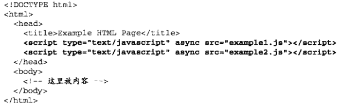
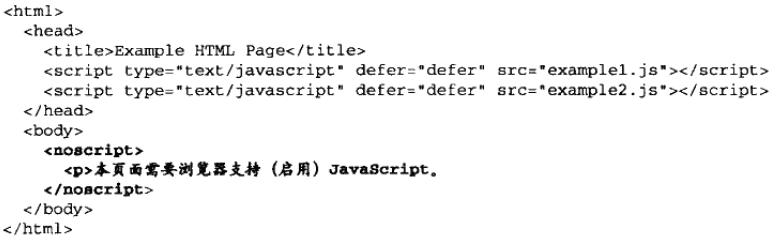

# 在HTML中使用Javascript

# 1. \

> \<script>标签可以直接加载w外部域的文件，与\标签类似。

## 2. 延迟脚本

以上两个脚本会在浏览器遇到\<html>标签后在执行。

>在现实当中，延迟脚本并不一定会按照顺序执行，也不一定会在DOMContentLoaded事件触发前执行。**因此最好只有一个延迟脚本**

## 3. 异步脚本

HTML5为\<script>定义了async属性，async属性只适用于外部文件，于defer功能类似。

> 区别：标记为async的脚本不保证按照它们的先后顺序执行。

> 两个async脚本之间不要有依赖关系，加载期间不要对DOM进行操作。

# 2. 文档模式

- 混杂模式: 不推荐使用

- 准标准模式: 与标准模式差别极小

- 标准模式: 推荐使用，减小跨浏览器的差异。HTML5使用\<!DOCTYPE html>开启。

# 3. \<noscript>元素

包含\<noscript>元素中的内容只会在以下两种情况才会显示出来

- 浏览器不支持脚本
- 浏览器支持脚本，但脚本被禁用

