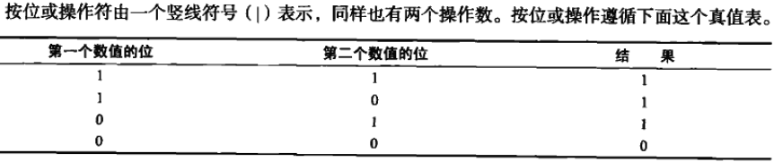

# 基本概念

# 1. 数据类型

ES5变量类型:undefined、null、boolean、number、string、object.(function、array).

检测方式: typeof，instanceof（推荐）

## 1.1 boolean类型

### 1.1.1 各类型转换结果

以下为其他类型与boolean的转换结果:


### 1.1.2 boolean 值类型转换

- Boolean() 方法

- ! : '非'符号转换,例如: !'string' === false;  -> true

- if: 条件语句

- = ：赋值符号

- && || : 逻辑运算

## 1.2 Nunber 类型

### 1.2.1 浮点数值

- e表示法: 3e3 = 3000; 3e-3 = 0.003

- 浮点数值最高精度为*17*位小数值。

- 浮点数值精确度不如整数。ES6 新增一个单位Number.EPSILON（极小的常量），规定误差范围小于此数的即为正确结果。


```
console.log((0.1-0.2) - 0.3 < Number.EPSILON)  
// true -> 正确结果，反之亦然
```

### 1.2.2 数值范围

- Math.max_value: 1.7976931348623157e+308
- Math.min_value: 5e-324
- 检测：isFinite() 对应 ES6 Number.isFinite(),区别：ES5会将非数值转换为数值再进行检测
- Infinity：正无穷或者负无穷,Nunber.NEGATIVE_INFINITY(负无穷) 和 Number.POSITIVE_INFINITY(正无穷)

### 1.2.3 NaN

- NaN(Not a Number): 非数值，一个特殊的数值。用于表示一个本应返回数值的操作未返回数值的情况。例如:任何数值除以0.

- NaN任何操作都返回NaN；NaN与任何数值都不相等，包括NaN本身。

**ES6 新方法Object.is(NaN,NaN),NaN等于自身。**

- 判断: isNaN()  对应 ES6 Number.isNaN(),区别在ES5会先将非数值转换为数值再进行检测。
```
console.log(isNaN('NaN'));              // true
console.log(Number.isNaN('NaN'));       // false
```

### 1.2.4 数值转换

- Number(),可用于任何数据类型

1. boolean： true -> 1 ; false -> 0
2. number: 简单的传入和返回
3. null: 0
4. undefined: NaN
5. string: 

6. object: 调用valueOf(),然后依照前面规则转换返回的值，如果返回NaN，则调用对象的toString()方法再一次转换。

- parseInt(),仅用于字符串类型，整数类型，小数点后会被忽略。返回：数值、0、NaN

- parseFloat(),仅用于字符串类型。

## 1.4 string

### 1.4.1 字符字面量

string数据类型包含一些特殊的字符字面量，也叫**转义序列**。

- \n  换行
- \t  制表
- \b  空格
- \r  回车
- \f  进纸
- \\  斜杠
- \\'  单引号
- \\"  双引号
- \xnn 以十六进制代码nn表示的一个字符(其中n为0~f)。例如: \x41，表示A。
- \unnnn 以十六进制代码nnnn表示的一个Unicode字符(其中n为0~f)。例如: \u03a3，表示希腊字母 Σσ。

### 1.4.2 字符串转换

- toString()  ->  let age = 10; age.toString(), null 和 undefined没有此方法。

toString有个参数，为数值的基数，输入对应数值，返回相应进制数。

- String() , 转换任何数据类型的值，包括null和undefined。

- \+ 操作符 , 字符串拼接，例如: 10 + '20'  -> '1020' 

## 1.5 Object类型

Object实例都具有以下属性和方法:

- Constructor：保存着用于创造当前对象的函数。

- hasOwnProrerty(propertyName): 用于检查给定的属性是否存在当前对象实例中（而不是在实例的原型中）。作为参数的属性名，必须以字符串形式指定。

ES6 新方法  Reflect.has() 类似 in操作。

- isPrototypeOf(object):用于检查传入的对象是否为另一个对象的原型。

- propertyIsEnumerable(propertyName): 用于检查给定的属性值是否支持for...in语句枚举。

- toLocaleString(): 返回对象的字符串表示。该字符串与执行环境的地区对应。测试:仅支持数组对象。

- toString(): 返回对象的字符串表示。与上方结果输出一致。

- valueOf(): 返回对象的字符串、数值和布尔值。通常与toString()返回值的相同。

# 2. 操作符

## 2.1 一元操作符 - 只能操作一个值的操作符

### 2.1.1 递加和递减操作符

- 前置型 例如:var age = 10; ++age;    // 11

执行前置递加和前置递减操作时，变量的值都是在**语句被求值以前改变**的（副效应）。
```
var age = 29;
var agetherAge = --age + 2;

console.log(age);            //28
console.log(agetherAge);     //30

// 变量age先执行递减操作，之后再加2，所以agetherAge = 28 + 2 = 30
```

- 后置型 例如:var age = 10; age++;    // 11

与前置型的区别: 递增和递减操作是在语句被求值之后执行。

```
var num1 = 2;
var num2 = 20;

// 前置型
var num3 = --num1 + num2;   // 21
var num4 = num1 + num2;     // 21

// 后置型
var num3 = num1-- + num2;   // 22, 区别
var num4 = num1 + num2;     // 21
```

- 对其他操作符的规则


### 2.1.2 一元加和减操作

- 放置在其他类型前，会执行类似Number()方式的转换。例如: +true,会把true先转换为1，即+1，返回值为1.

## 2.2 位操作符

### 2.2.1 按位非(~)

按位非操作由一个波浪号(~)表示，执行按位非操作的结果就是返回数值的反码。
```
var num1 = 25;
var num2 = ~num1;

console.log(num2); // -26

// 测试
var num1 = 8;
var num2 = ~num1;

console.log(num2); // -9
```
本质：操作数的负值 - 1 
```
// 测试
var num1 = -8;
var num2 = ~num1;

console.log(num2); // 7
```

### 2.2.2 按位与(&)

按位与操作由一个和号(&)表示。


### 2.2.3 按位或(|)

按位或操作由一个竖线(|)表示。


### 2.2.4 按位异或(^)

按位异或操作由一个插入符号(^)表示。相同为假，不同为真。


### 2.2.5 左移(<<)

左移操作符由两个小于号(<<)组成，会将数值的所有位向左移动指定的位数。左移操作不会影响符号位，例如: 2 左移 5位 = 64; -2 左移 5位 = -64。

### 2.2.6 有符号的右移(>>)

有符号的右移操作符由两个大于号(>>)组成，会将数值向右移动，但保留符号位。

### 2.2.7 无符号的右移(>>>)

无符号的右移操作符由三个大于号(>>>)组成，这个操作会将数值的所有32位都向右移动。对于。 对于正数,有符号右移和无符号右移结果相同。

## 2.3 布尔操作符

### 2.3.1 逻辑非(!)

转换规则


> 小技巧：两个逻辑非符号转换为原先数据类型为对应的boolean型。

### 2.3.2 逻辑与(&&)

逻辑与操作符由两个和号(&&)表示。


逻辑与操作可以应用于任何类型的操作数，而不仅仅是布尔值。在一个有操作数不是布尔值的情况下，**逻辑与不一定返回布尔值**

- 如果第一个操作数是对象，则返回第二个操作数。
```
var obj = {};            // 对象为真

var flag1 = false;
var flag2 = true;

console.log(obj && flag1);   //false
console.log(obj && flag2);   //true
```

- 如果第二个操作数是对象，只有在第一个求值结果为true时，返回对象
```
var obj = {};            // 对象为真

var flag1 = false;
var flag2 = true;

console.log(flag1 && obj);   //false
console.log(flag2 && obj);   //true
```

- 如果两个操作数都是对象，则返回第二个操作数。
```
var obj1 = {'bar':'bar'};            // 对象为真
var obj2 = {'foo':'foo'};            // 对象为真

console.log(obj1 && obj2);   //false
```

- 如果有一个操作数是null，则返回null。

- 如果有一个操作数是NaN，则返回NaN。

- 如果有一个操作数undefined，则返回undefined。

逻辑与操作属于**短路操作**，即如果第一个操作数能够决定结果，就不会再对第二个操作数求值。如果第一个操作数是false，则无论第二个操作数是什么值，结果都是false。

### 2.3.3 逻辑或(||)

逻辑或操作符由两个竖线号(||)表示。


逻辑或操作，如果一个操作数不是布尔值，逻辑或也不一定返回布尔值。

- 如果第一个操作数是对象，则返回第一个操作数。

- 如果第一个操作数的求值结果是false，则返回第二个操作数。

- 如果两个操作数都是对象，则返回第一个操作数。

- 如果两个操作数都是null，则返回null。

- 如果连个操作数都是NaN，则返回NaN。

- 如果两个操作数都是undefined，则返回undefined。

逻辑或也是短路操作符。如果第一个操作数的求值结果为true，就不会对第二个操作数求值。

## 2.4 乘性操作符

操作数在为非数值的情况下会执行自动的类型转换。

### 2.4.1 乘法

乘法操作符由一个星号(*)表示。


### 2.4.2 除法

除法操作符由一个斜线符号(/)表示。

### 2.4.3 求模

求模(余数)由一个百分号(%)表示。

## 2.5 加性操作符

### 2.5.1 加法

加法操作符由一个加号(+)表示。加法遵循以下规则:

- 如果一个操作数是NaN，结果NaN。
- 如果是Infinity加Infinity，结果Infinity。
- 如果是-Infinity加-Infinity，结果Infinity。
- 如果是Infinity加-Infinity，结果NaN。
- 如果是+0 加 +0，结果 +0.
- 如果是-0 加 -0，结果 -0.
- 如果是+0 加 -0，结果 +0.

>如果一个操作符是字符串，那么就要应用如下下列规则。
- 如果两个操作数都是字符串，则将第二个操作数与第一个操作数拼接起来。
- 如果只有一个操作数是字符串，则将两一个操作数转换为字符串，然后再将两个字符串拼接起来。

如果一个操作数是对象、数值、布尔值，则调用它们的toString()方法取得相应的的字符串值，然后在拼接起来。对于null、undefined则调用String()转换为'null','undefined'。

> 小技巧如果想在字符串后又求值，可以使用括号扩起来。例如:
```
var num1 = 10;
var num2 = 5;

var message = "num1 + num2 =" + (num1 + num2);  // "num1 + num2 =15";

var mes = "num1 + num2 =" + num1 + num2; // "num1 + num2 =105"
```

### 2.5.2 减法

减法操作符由一个减号(-)表示。遵循下列规则。

- 如果两个操作数都是数值，执行常规的减法操作。
- 如果一个操作数为NaN,结果为NaN
- 如果是Infinity 减 Infinity，结果为NaN
- 如果是-Infinity 减 -Infinity，结果为NaN
- 如果是Infinity 减 -Infinity，结果为Infinity
- 如果是-Infinity 减 Infinity，结果为-Infinity
- 如果是+0 减 +0，结果为+0
- 如果是-0 减 -0，结果为-0
- 如果是+0 减 -0，结果为+0
- 如果是-0 减 +0，结果为-0
- 如果有一个操作数的字符串、布尔值、null(0)、undefined(NaN),则先调用Number()转换为数值。
- 如果一个操作数是对象，则调用对象的valueOf()方法以取得表示该对象的数值。如果得到NaN，结果即为NaN，否则调用toString转换为字符串，在遵循字符串计算。

## 2.6 关系操作符(<,>,<=,>=)

- 如果两个操作数都为数值，则执行数值比较。
- 如果两个操作数都是字符串，则比较两个字符串对象的字符串编码值。
- 如果一个操作数是数值，则将另一个操作数转换为数值，再执行数值比较。
- 如果一个操作数是对象，则调用valueOf()方法，如果没有valueOf()，则调用toString()方法，再执行数值比较。
- 如果有一个操作数是布尔值、null、undefined，则先转换为数值再执行数值比较。
- 如果有一个操作数是NaN，则一定返回false。

## 2.7 相等操作符

> 相等和不相等会先进行转换再比较
> 全等和不全等不会进行转换，直接比较。

### 2.7.1 相等(==)和不相等(!=),都会进行强制转型

转换类型时遵循以下规则：

- 如果一个操作数是布尔值，比较相等性之前先将其转换为数值。true -> 1;false -> 0
- 如果一个操作数是字符串，另一个操作数是数值，比较相等性之前，先将字符串转换为数值
- 如果一个操作是对象，另一个操作数不是，则调用对象的valueOf()方法，然后在...
- null 和 undefined 是相等的。
- 要比较相等性之前，不能将null和undefined转换成其他任何值。
- 如果有一个操作数是NaN，则相等操作符返回false，不相等操作符返回true。
- 如果两个操作数都是对象，则比较它们是不是同一个对象。如果两个操作数都指向同一对象，则相等操作符返回true，否则返回false。
```
// 相等
var obj1 = {};
var obj2 = obj1;

console.log(obj1 == obj2)  // true

// 不相等
var obj1 = {};
var obj2 = {};

console.log(obj1 == obj2)  // false
```


### 2.7.2 全等和不全等

除了不进行强制转换，其他和相等、不相等操作符一致。

## 2.8 条件操作符(?)

条件操作符由一个问号(?)表示，即三元表达式。

## 2.9 赋值操作符

- 简单的赋值操作由等于号(=)表示。

- 在等于号前添加乘性操作符、加性操作符、位操作符，即为复合操作符。
```
var num = 10;
num1 += num;   // num1 = num1 + num;
```

## 2.10 逗号操作符

使用逗号操作符可以在一条语句中执行多个操作，如下面的例子:

> 声明变量
```
var num1 = 1, num2 = 2, num3 = 3;

```

> 赋值
```
var num = (5,4,8,6,9,10,0);   // num = 0
```
以上代码 0 是表达式的最后一项，因此num值为0。

# 3. 语句

## 3.1 if语句

## 3.2 do..while...语句

do..while.. 是一种后测试循环语句，即只有在循环体中的代码执行后才会测试出口条件。

> 在条件表达式求值之前，循环体内的代码至少执行一次。
```
do {
  statement
} while (expression)
```

```
var i = 0;
do {
  i += 2;  // 循环体
} while (
  i < 10  // 条件
)

console.log(i);
```

## 3.3 while 语句

while 属于前测试循环语句。

## 3.4 for 语句

for 属于前测试循环语句。

> while语句做不到的，for语句也做不到。

> ES5不存在块级作用域，因此在循环内部定义的变量在循环体外也可以访问。
```
var count = 10;

for (var i = 0; i < 10; i++) {
  console.log(i)  // 0 1 2 3 4 5 6 7 8 9
}

console.log(i);  // 10

// ES6 使用let 定义变量的块级作用域
```

> for循环的初始化表达式、条件表达式、循环后表达式都是可选的。
```
// 无限
for(;;) {
  // 无限循环
}

for(;true;) {

}
```

## 3.5 for..in 语句
for...in 语句是一种精准的迭代语句。用来枚举对象的属性。

> for...in 循环输出的属性名顺序是不可测的（无序）。

> 建议使用for...in循环之前，先检测对象是否为null或者undefined。

## 3.6 label

使用label语句可以给代码添加标签，以便将来使用。
```
start: for (var i=0; i < 100;i++) {
  console.log(i);
}
```
以上代码定义的start标签，可以将来有break或continue语句引用。

> 加标签的语句一般都要和for语句等循环语句配合使用。

## 3.7 break 和 continue

break 和 continue 语句用于在循环中精确控制代码的执行。

> break 会立即退出循环，强制执行循环体后面的语句。
```
var num = 0;

for(var i =1;i<10;i++) {
  if(i %5 ===0 ){
    break
  }
  num++;
}

console.log(num); // 4
```

> continue 会立即退出当前循环，从下一个循环继续执行。
```
var num = 0;

for(var i =1;i<10;i++) {
  if(i %5 ===0 ){
    continue
  }
  num++;
}

console.log(num); // 8
```

> break 和 continue 语句都可以和label语句联合使用，返回代码的特定位置。多发生在联合嵌套内.
```
// break
var num = 0;

outermost: for (var i = 0; i < 10;i++) {
  for(var j = 0; j < 10;j++) {
    if(i == 5 && j ==5) {
      break outermost;
    }
    num++
  }
}

console.log(num); // 55

// 使用break、label语句联合，不只退出内部循环(j),外部循环也会退出(i).

outermost: for (var i = 0; i < 10;i++) {
  for(var j = 0; j < 10;j++) {
    if(i == 5 && j ==5) {
      break;  // 不使用label
    }
    num++
  }
}

console.log(num); // 95
```
```
// continue
var num = 0;

outermost: for (var i = 0; i < 10;i++) {
  for(var j = 0; j < 10;j++) {
    if(i == 5 && j ==5) {
      continue outermost;
    }
    num++
  }
}

console.log(num); // 95
// 退出内部循环，执行外部循环

outermost: for (var i = 0; i < 10;i++) {
  for(var j = 0; j < 10;j++) {
    if(i == 5 && j ==5) {
      continue;
    }
    num++
  }
}

console.log(num); // 99
```

## 3.8 with语句

with 语句的作用是将代码的作用域设置到一个特定的对象中。with语句语法如下:
```
with(object) statement
```

> 定义with语句的目的主要是为了简化多次编写同一个对象的工作，如下面的例子:
```
var qs = location.search.substring(1);
var hostname = location.hostname;
var url = location.href;

// 简化为
with(location) {
  var qs = search.subsrting(1);
  var hostname = hostname;
  var url = href;
}
```
> 严格模式下不允许使用with语句。

## 3.9 switch语句

switch语句与if语句关系最为密切。

> 与其他语言的区别，switch语句可以使用任何数据类型，包括数值、字符串、对象、表达式等
```
switch('hello word') {
  case 'hello ' + 'world':      //字符串表达式
    console.log('hello world');
    break;
  case 'goodbye':
    console.log('goodbye');
    break;
  default:
    console.log('default');
}
```

## 4. 函数

### 4.1 函数参数(arguments)

- 函数体内可以通过arguments对象访问参数。
- arguments的length属性获知函数参数个数。
- arguments对象中的值会自动反映到命名的参数。但两个值的都有独立的内存空间，只是这个操作会同步。
- 第三步的操作是单向的，修改命名参数不会同步到arguments对象中的值。 // **测试后，同步是双向的**。
```
// 会同步
function addO(num1,num2) {
  arguments[1] = 10;
  console.log(num2);
}

addO(100,200);   // 10

// 不同步
function addO(num1,num2) {
  num2 = 1000;
  console.log(arguments[1]);
}

addO(100,200);   // 1000，chrome测试会同步，360兼容模式也会同步
```
- 没有传递值的命名参数的值为undefined(同未赋值的变量类似)。

### 4.2 没有重载

> JS函数无法像其他语言一样实现重载。若定义两个同名函数，则后定义函数有效。无论参数是否不同。