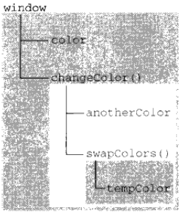

# 变量 作用域 内存问题

# 1. 变量

- 特性:松散类型，可以在生命周期内修改变量的数据类型。

- 值类型:undefined null boolean number string

- 引用类型:object，无法访问内存中的位置，只能操作对象的引用。
```
var obj1 = {a:9,b:10};
var obj2 = obj1;
obj2.a = 100;

console.log(obj1.a);  // 100
```

## 1.1 动态属性

> 引用类型可以动态添加属性

> 值类型无法动态添加属性

## 1.2 复制变量值

> 引用类型赋值是复制引用指针，本质上都指向内存中的同一对象。

> 值类型赋值是创建新值赋值给新变量，后续两个变量互不影响。

## 1.3 传递参数

> 参数传递为按值传递

> 如果参数为一个对象，引用也将赋值给命名参数，但仍然是按值传递。下方例子:
```
function setObj(obj) {
  obj.name = 'YJob';
}

var person = {};
setObj(person);

console.log(person.name);    // YJob

// 证明
function setObj(obj) {
  obj.name = 'YJob';
  obj = {};               // 已经变成局部变量
  obj.name = 'WriteJob';
}

var person = {};
setObj(person)；

console.log(person.name);  // YJob
```

## 1.4 检测类型

> typeof
```
var a = undefined;
var b = true;
var c = 'string';
var d = 10;
var f = null;
var g = {};
var h = [];
var i = function i(){};

console.log(typeof a);     //undefined
console.log(typeof b);     //boolean
console.log(typeof c);     //string
console.log(typeof d);     //number
console.log(typeof f);     //object
console.log(typeof g);     //object
console.log(typeof h);     //object
console.log(typeof i);     //function

// 正则表达式用typeof检测，部分返回function，部分返回object
```

> instanceof
```
var o = {};
var a = [];
var n = null;
var f = function f() {};

console.log(o instanceof Object);   // true
console.log(o instanceof Array);    // false
console.log(a instanceof Array);    // true
console.log(a instanceof Object);   // true
console.log(n instanceof Object);   // false
console.log(f instanceof Function);  // true
```

# 2. 执行环境(执行上下文)和作用域

> 全局执行环境是最外围的执行环境,根据宿主环境不同，全局环境也不相同。

- WEB浏览器: window对象
- nodejs: Global对象

> 每个函数都有自己的执行对象。

> 作用域链，在当前作用域未能找到变量的定义会在上一级作用域中继续寻找，寻找链即为作用域链。

> 在当前作用域中未定义的变量，称为:自由变量。

```
var color = 'blue';

function changColor() {
  var anotherColor = 'red';

  function swapColor() {
    var tempColor = 'yellow';
    anotherColor = color;
    color = temColor;      

    // 可以访问 color、anotherColor、temColor 变量
  }

  swapColor();

  // 可以访问color、anotherColor变量
}

changColor();

// 只能访问color变量。
```
以下图片为以上代码的作用域链，内部环境可以通过作用域链访问外部环境。外部环境无法访问内部环境的变量、函数等。



## 2.1 延长作用域链

> try...catch 的 catch 块，会创建新的变量对象，其中包含的是被抛出的错误对象的声明。

> with 语句,会将指定的对象添加到作用域链中。
```
function buildUrl() {
  var qs = "?debug=true";

  with(location) {
    var url = location.href + qs;
  }

  return url;
}
```


## 2.2 块级作用域

> ES5 没有块级作用域。

> ES6 可以提供块级作用域。使用关键字 let 、const

> 变量、函数提升到最近作用域的顶部。

# 3. 垃圾收集

> Javascript 具有垃圾自动收集机制。定期(或者代码中预定的收集时间),周期性的执行一次操作。清理不再使用的变量。

> 手工解除: 将其设置为null