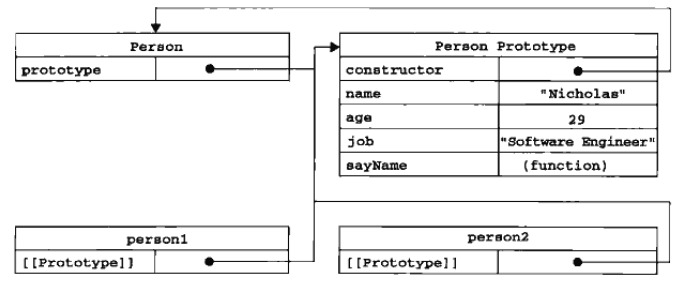

# 面向对象的程序设计

> 对象:无序属性的集合，包含基本值、对象或者函数。

# 1. 理解对象

## 1.1 属性类型

### 1. 数据属性

数据属性包含一个数据值的位置。数据属性有4个描述其行为的特性:

- [[Configurable]]: 表示能否通过delete删除属性，从而重新定义。

- [[Enumerable]]: 表示是否能通过for-in循环返回属性(是否可枚举)。

- [[Writable]]: 表示是否能修改属性的值。

- [[Value]]: 表示属性的值。默认值为undefined。

直接在对象上定义的属性。[[Configurable]] [[Enumerable]] [[Writable]] 都默认为true。[[Value]]被设置为特定的值。

> ES6 有一个方法Object.getOwnPropertyDescriptor()可查看属性这些值。

> 要修改对象的特性，使用Object.defineProperty()方法。接收三个参数:属性所在的对象，属性名，值(ES6用Reflect.defineProperty()代替)。
```
var obj = { name: 'YJob' };

Object.defineProperty(obj, 'name', {
  value: 'WriteJob',
  configurable: true,
  enumerable: true,
  writable: true
});

console.log(Object.getOwnPropertyDescriptor(obj,'name'));


console.log(obj.name);
// 结果如预期一样

// Object.defineProperty(obj, 'name', {
//   //value: 'WriteJob002'             //报错
//   // configurable: true              //报错
//   //enumerable: true                 //报错
//   //writable: true                   //报错
// });

obj.name = 'Write002';                  //无效，因为之前已经设置为false

console.log(obj.name);
```

[[Configurable]]设置为false之后，在调用Object.defineProperty()修改除Writable之外的其他特性，都会报错。
**测试后: false -> true,报错。true -> 不报错**

> 使用Object.defineProperty()定义的属性，configurable、enumerable、writable默认为false。

### 2. 访问器属性

访问器属性不包含数据值。包含一对函数getter和setter函数(非必须，IE8不支持)。具有以下4个特性

- [[Configurable]]: 表示能否通过delete删除属性，从而重新定义.或者能否把数据重新定义为数据属性。

- [[Enumerable]]: 表示能否通过for-in循环返回属性。

- [[Get]]: 在读取属性时调用的函数。默认为undefined。

- [[Set]]: 在写入属性时调用的函数。默认为undefined。

访问属性不能直接定义，必须使用Object.defineProperty()来定义。

```
var book = {
  _year:2004,
  edition:1
}

Object.defineProperty(book,'year',{    // 注意，无下划线
  get: function() {
    return this._year;
  },
  set: function(newVal) {
    if(newVal > 2004) {
      console.log(newVal);
      this._year = newVal;
      this.edition += newVal - 2004;
    } else {
      this._year = 2004;
    }
  }
})

book.year = 2008;    // 注意，无下划线

console.log(book);
```
以上代码创建了一个book对象，并给定两个两个默认的属性:_year和edition。_year前面的下划线是一种常用的记号，用于表示只能通过对象方法访问的属性。而访问器属性year则包含一个getter函数和一个setter函数。getter函数用于返回_year的值，setter函数通过计算来确定正确的版本。这是使用访问器属性常用的方式: **即设置一个属性的值会导致其他属性发生变化**

不一定非同同时指定getter和setter。

- 只指定getter，表示属性不可写入。尝试写入会被忽略。

- 只指定setter，表示属性不可读取。尝试读取返回undefined。

## 1.2 定义多个属性

Object.defineProperties()方法可以一次描述多个对象属性。接收两个对象参数。第一个对象是要添加和修改其属性的对象。第二个对象的属性与第一个对象的属性一一对应.
```
var book = {};

Object.defineProperties(book, {
  _year: {
    value: 2004,
    configurable:true,
    writable:true,
    enumerable:true
  },
  edition: {
    value: 1,
    configurable:true,
    writable:true,
    enumerable:true
  },
  year: {
    get: function () {
      return this._year;
    },
    set: function (newVal) {
      if (newVal > 2004) {
        this._year = newVal;
        this.edition += newVal - 2004;
      }
    }
  }
})

book.year = 2008;

console.log(book);  // 2008,5

console.log(Object.getOwnPropertyDescriptors(book));
```

## 1.3 读取属性的特性

Object.getOwnPropertyDescriptor()方法，可以取得给定属性的描述符。接收两个参数：属性所在的对象和属性名。访问器属性返回configurable、enumerable、get、set。数据属性返回configurable、enumerable、writable、value。

ES6新增Object.getOwnPropertyDescriptors()方法，批量获取对象属性的描述符。

# 2. 创建对象

创建大量对象，避免使用重复代码的办法的发展历程

## 2.1 工厂模式

软件领域广为人知的设计模式，用函数来封装以特定接口创建对象的细节，例如：
```
function createPerson(name, age, job) {
  var o = new Object();
  o.name = name;
  o.age = age;
  o.job = job;
  o.sayName = function() {
    console.log(this.name);
  }

  return o;
}

var person1 = createPerson('YJob',27,'前端');
var person2 = createPerson('WriteJob',28,'python');

person1.sayName();
person2.sayName();
```
**工厂模式虽然解决了创建多个相似对象的问题，但却没有解决对象识别的问题（识别对象类别）**。

## 2.2 构造函数

构造函数可以创造特定类型的对象。像Object和Array这样的原生构造函数，在运行时会自动出现在执行环境中。创建自定义对象类型的构造函数和方法。
```
function Person(name,age,job) { //构造函数this指向创建的实例。
  this.name = name;
  this.age = age;
  this.job = job;

  this.sayName = function() {
    console.log(this.name);
  }
} 

var person1 = new Person('YJob',27,'前端');
var person2 = new Person('WriteJob',28,'python');

person1.sayName();
person2.sayName();
```
与工厂模式不同之处:
- 没有显示创建对象
- 直接将属性和方法赋予this对象
- 没有retuen语句

**构造函数名以大写字母开头**

### 2.2.1 将构造函数当做函数

构造函数与其他函数的区别就是调用方式不同。也可以当做普通函数使用。
```
// 当做构造函数
var person = new Person('YJob',27,'前端');
person.sayName();   //YJob, this -> 创建的实例

// 当做普通函数
Person('YJob',27,'前端');
window.sayName();   //YJob, this -> window

// 在另一个对象的作用域中调用
var o = {};
Person.call(o,'YJob',27,'前端');
o.sayName();        //YJob, this -> o
```

### 2.2.2 构造函数的问题

使用构造函数的缺陷:每个**方法**都要在每个实例上重新创建一遍。前面的例子中，person1 和 person2 都有一个sayName()方法，但两个方法不是在同一个Function实例上。ES5中的函数是一个对象，因此没定义一个函数，也是实例化一个对象。上方例子也可以如下写:
```
function Person(name,age,job) {
  this.name =name;
  this.age = age;
  this.job = job;

  this.sayName = new Function("console.log(name)");  // 和声明函数在逻辑上是等价的。
}
```
从这个角度上看构造函数，更容易明白每个Person实例都包含一个不同的Function实例的本质。不同实例上的同名函数是不相等的。
```
console.log(person1.sayName === person2.sayName); //false
```
创建两个完成相同任务的Function实例的确没有必要。有this对象在，不用在执行代码前就把函数绑定到特定对象上。可以通过把函数定义转移到构造函数外来解决问题。
```
function Person(name, age, job){
  this.name = name;
  this.age = age;
  this.job = job;

  this.sayName = sayName;   //sayName在此作用域内未定义，根据作用域链查找在上级作用域
}

function sayName() {
  console.log(this.name);
}

var person1 = new Person('YJob',27,'前端');
var person2 = new Person('WirteJob',28,'python');

console.log(person1.sayName === person2.sayName);  // true
```

**新的问题：全局作用域定义的函数实际上只能被某个对象调用，这让全局作用域有点名不副实。如果对象需要定义很多方法，就要定义很多全局函数，那这个自定义的引用类型就没有封装性可言了，如何解决？**

## 2.3 原型模式

创建的每个函数都有一个prototype(原型)属性。这属性是一个指针，指向一个对象。而这个对象的用途是包含可以由特定类型的所有**实例共享的属性和方法**。原型对象的好处就是可以让所有对象实例共享它包含的属性和方法。换句话说，不用在构造函数中定义对象实例的信息，而是可以将这些信息直接添加到原型对象中。
```
function Person() {};

Person.prototype.name = 'YJob';
Person.prototype.age = 27;
Person.prototype.job = '前端';

Person.prototype.sayName = function() {
  console.log(this.name);
}

var person1 = new Person();
var person2 = new Person();

person1.sayName();
person2.sayName();

console.log(person1.sayName === person2.sayName); //true
```

### 2.3.1 理解原型对象

所有个原型对象都有一个constructor(构造函数)属性，这个函数指向prototype属性**所在函数**的指针。


可以通过isPrototypeOf()来确定对象之间是否存在关系。
```
console.log(Person.prototype.isPrototypeOf(person1));  // true
console.log(Person.prototype.isPrototypeOf(person2));  // true

console.log(Person.isPrototypeOf(person1));            // false
console.log(Person.isPrototypeOf(person2));            // false
```

> ES5新增了一个方法Object.getPrototyoeOf()
```
console.log(Object.getPrototype(person1) === Person.prototype); //true

console.log(Object.getPrototype(person1).name); //YJob
```

> 对象实例可以访问原型对象中的值，但无法重写原型对象中的值。
```
function Person() {};

Person.prototype.name = 'YJob';
Person.prototype.age = 27;
Person.prototype.job = '前端';

Person.prototype.sayName = function() {
  console.log(this.name);
}

var person1 = new Person();
var person2 = new Person();

person1.name = 'WritdJob';

console.log(person1.name); //WritdJob
console.log(person2.name); //YJob
```
> 使用delete操作符可以完全删除实例属性
```
function Person() {};

Person.prototype.name = 'YJob';
Person.prototype.age = 27;
Person.prototype.job = '前端';

Person.prototype.sayName = function() {
  console.log(this.name);
}

var person1 = new Person();
var person2 = new Person();

person1.name = 'WritdJob';

console.log(person1.name); //WritdJob
console.log(person2.name); //YJob

delete person1.name;

console.log(person1.name); //YJob
```

> hasOwnProperty()方法