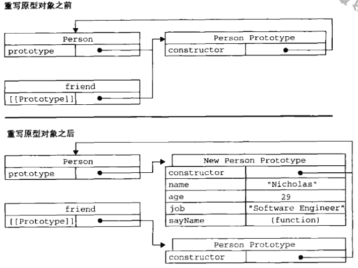
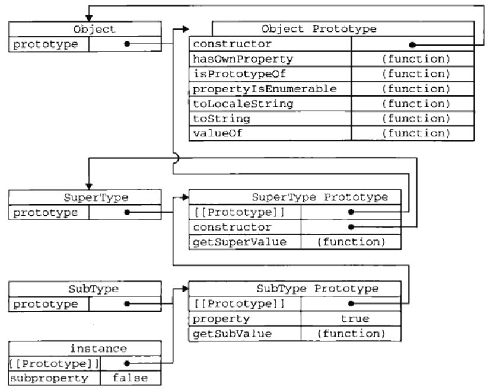

# 面向对象的程序设计

> 对象:无序属性的集合，包含基本值、对象或者函数。

# 1. 理解对象

## 1.1 属性类型

### 1. 数据属性

数据属性包含一个数据值的位置。数据属性有4个描述其行为的特性:

- [[Configurable]]: 表示能否通过delete删除属性，从而重新定义。

- [[Enumerable]]: 表示是否能通过for-in循环返回属性(是否可枚举)。

- [[Writable]]: 表示是否能修改属性的值。

- [[Value]]: 表示属性的值。默认值为undefined。

直接在对象上定义的属性。[[Configurable]] [[Enumerable]] [[Writable]] 都默认为true。[[Value]]被设置为特定的值。

> ES6 有一个方法Object.getOwnPropertyDescriptor()可查看属性这些值。

> 要修改对象的特性，使用Object.defineProperty()方法。接收三个参数:属性所在的对象，属性名，值(ES6用Reflect.defineProperty()代替)。
```
var obj = { name: 'YJob' };

Object.defineProperty(obj, 'name', {
  value: 'WriteJob',
  configurable: true,
  enumerable: true,
  writable: true
});

console.log(Object.getOwnPropertyDescriptor(obj,'name'));


console.log(obj.name);
// 结果如预期一样

// Object.defineProperty(obj, 'name', {
//   //value: 'WriteJob002'             //报错
//   // configurable: true              //报错
//   //enumerable: true                 //报错
//   //writable: true                   //报错
// });

obj.name = 'Write002';                  //无效，因为之前已经设置为false

console.log(obj.name);
```

[[Configurable]]设置为false之后，在调用Object.defineProperty()修改除Writable之外的其他特性，都会报错。
**测试后: false -> true,报错。true -> 不报错**

> 使用Object.defineProperty()定义的属性，configurable、enumerable、writable默认为false。

### 2. 访问器属性

访问器属性不包含数据值。包含一对函数getter和setter函数(非必须，IE8不支持)。具有以下4个特性

- [[Configurable]]: 表示能否通过delete删除属性，从而重新定义.或者能否把数据重新定义为数据属性。

- [[Enumerable]]: 表示能否通过for-in循环返回属性。

- [[Get]]: 在读取属性时调用的函数。默认为undefined。

- [[Set]]: 在写入属性时调用的函数。默认为undefined。

访问属性不能直接定义，必须使用Object.defineProperty()来定义。

```
var book = {
  _year:2004,
  edition:1
}

Object.defineProperty(book,'year',{    // 注意，无下划线
  get: function() {
    return this._year;
  },
  set: function(newVal) {
    if(newVal > 2004) {
      console.log(newVal);
      this._year = newVal;
      this.edition += newVal - 2004;
    } else {
      this._year = 2004;
    }
  }
})

book.year = 2008;    // 注意，无下划线

console.log(book);
```
以上代码创建了一个book对象，并给定两个两个默认的属性:_year和edition。_year前面的下划线是一种常用的记号，用于表示只能通过对象方法访问的属性。而访问器属性year则包含一个getter函数和一个setter函数。getter函数用于返回_year的值，setter函数通过计算来确定正确的版本。这是使用访问器属性常用的方式: **即设置一个属性的值会导致其他属性发生变化**

不一定非同同时指定getter和setter。

- 只指定getter，表示属性不可写入。尝试写入会被忽略。

- 只指定setter，表示属性不可读取。尝试读取返回undefined。

## 1.2 定义多个属性

Object.defineProperties()方法可以一次描述多个对象属性。接收两个对象参数。第一个对象是要添加和修改其属性的对象。第二个对象的属性与第一个对象的属性一一对应.
```
var book = {};

Object.defineProperties(book, {
  _year: {
    value: 2004,
    configurable:true,
    writable:true,
    enumerable:true
  },
  edition: {
    value: 1,
    configurable:true,
    writable:true,
    enumerable:true
  },
  year: {
    get: function () {
      return this._year;
    },
    set: function (newVal) {
      if (newVal > 2004) {
        this._year = newVal;
        this.edition += newVal - 2004;
      }
    }
  }
})

book.year = 2008;

console.log(book);  // 2008,5

console.log(Object.getOwnPropertyDescriptors(book));
```

## 1.3 读取属性的特性

Object.getOwnPropertyDescriptor()方法，可以取得给定属性的描述符。接收两个参数：属性所在的对象和属性名。访问器属性返回configurable、enumerable、get、set。数据属性返回configurable、enumerable、writable、value。

ES6新增Object.getOwnPropertyDescriptors()方法，批量获取对象属性的描述符。

# 2. 创建对象

创建大量对象，避免使用重复代码的办法的发展历程

## 2.1 工厂模式

软件领域广为人知的设计模式，用函数来封装以特定接口创建对象的细节，例如：
```
function createPerson(name, age, job) {
  var o = new Object();
  o.name = name;
  o.age = age;
  o.job = job;
  o.sayName = function() {
    console.log(this.name);
  }

  return o;
}

var person1 = createPerson('YJob',27,'前端');
var person2 = createPerson('WriteJob',28,'python');

person1.sayName();
person2.sayName();
```
**工厂模式虽然解决了创建多个相似对象的问题，但却没有解决对象识别的问题（识别对象类别）**。

## 2.2 构造函数

构造函数可以创造特定类型的对象。像Object和Array这样的原生构造函数，在运行时会自动出现在执行环境中。创建自定义对象类型的构造函数和方法。
```
function Person(name,age,job) { //构造函数this指向创建的实例。
  this.name = name;
  this.age = age;
  this.job = job;

  this.sayName = function() {
    console.log(this.name);
  }
} 

var person1 = new Person('YJob',27,'前端');
var person2 = new Person('WriteJob',28,'python');

person1.sayName();
person2.sayName();
```
与工厂模式不同之处:
- 没有显示创建对象
- 直接将属性和方法赋予this对象
- 没有retuen语句

**构造函数名以大写字母开头**

### 2.2.1 将构造函数当做函数

构造函数与其他函数的区别就是调用方式不同。也可以当做普通函数使用。
```
// 当做构造函数
var person = new Person('YJob',27,'前端');
person.sayName();   //YJob, this -> 创建的实例

// 当做普通函数
Person('YJob',27,'前端');
window.sayName();   //YJob, this -> window

// 在另一个对象的作用域中调用
var o = {};
Person.call(o,'YJob',27,'前端');
o.sayName();        //YJob, this -> o
```

### 2.2.2 构造函数的问题

使用构造函数的缺陷:每个**方法**都要在每个实例上重新创建一遍。前面的例子中，person1 和 person2 都有一个sayName()方法，但两个方法不是在同一个Function实例上。ES5中的函数是一个对象，因此没定义一个函数，也是实例化一个对象。上方例子也可以如下写:
```
function Person(name,age,job) {
  this.name =name;
  this.age = age;
  this.job = job;

  this.sayName = new Function("console.log(name)");  // 和声明函数在逻辑上是等价的。
}
```
从这个角度上看构造函数，更容易明白每个Person实例都包含一个不同的Function实例的本质。不同实例上的同名函数是不相等的。
```
console.log(person1.sayName === person2.sayName); //false
```
创建两个完成相同任务的Function实例的确没有必要。有this对象在，不用在执行代码前就把函数绑定到特定对象上。可以通过把函数定义转移到构造函数外来解决问题。
```
function Person(name, age, job){
  this.name = name;
  this.age = age;
  this.job = job;

  this.sayName = sayName;   //sayName在此作用域内未定义，根据作用域链查找在上级作用域
}

function sayName() {
  console.log(this.name);
}

var person1 = new Person('YJob',27,'前端');
var person2 = new Person('WirteJob',28,'python');

console.log(person1.sayName === person2.sayName);  // true
```

**新的问题：全局作用域定义的函数实际上只能被某个对象调用，这让全局作用域有点名不副实。如果对象需要定义很多方法，就要定义很多全局函数，那这个自定义的引用类型就没有封装性可言了，如何解决？**

## 2.3 原型模式

创建的每个函数都有一个prototype(原型)属性。这属性是一个指针，指向一个对象。而这个对象的用途是包含可以由特定类型的所有**实例共享的属性和方法**。原型对象的好处就是可以让所有对象实例共享它包含的属性和方法。换句话说，不用在构造函数中定义对象实例的信息，而是可以将这些信息直接添加到原型对象中。
```
function Person() {};

Person.prototype.name = 'YJob';
Person.prototype.age = 27;
Person.prototype.job = '前端';

Person.prototype.sayName = function() {
  console.log(this.name);
}

var person1 = new Person();
var person2 = new Person();

person1.sayName();
person2.sayName();

console.log(person1.sayName === person2.sayName); //true
```

### 2.3.1 理解原型对象

所有个原型对象都有一个constructor(构造函数)属性，这个属性指向prototype属性**所在函数**的指针。


可以通过isPrototypeOf()来确定对象之间是否存在关系。
```
console.log(Person.prototype.isPrototypeOf(person1));  // true
console.log(Person.prototype.isPrototypeOf(person2));  // true

console.log(Person.isPrototypeOf(person1));            // false
console.log(Person.isPrototypeOf(person2));            // false
```

> ES5新增了一个方法Object.getPrototyoeOf()
```
console.log(Object.getPrototype(person1) === Person.prototype); //true

console.log(Object.getPrototype(person1).name); //YJob
```

> 对象实例可以访问原型对象中的值，但无法重写原型对象中的值。
```
function Person() {};

Person.prototype.name = 'YJob';
Person.prototype.age = 27;
Person.prototype.job = '前端';

Person.prototype.sayName = function() {
  console.log(this.name);
}

var person1 = new Person();
var person2 = new Person();

person1.name = 'WritdJob';

console.log(person1.name); //WritdJob
console.log(person2.name); //YJob
```
> 使用delete操作符可以完全删除实例属性
```
function Person() {};

Person.prototype.name = 'YJob';
Person.prototype.age = 27;
Person.prototype.job = '前端';

Person.prototype.sayName = function() {
  console.log(this.name);
}

var person1 = new Person();
var person2 = new Person();

person1.name = 'WritdJob';

console.log(person1.name); //WritdJob
console.log(person2.name); //YJob

delete person1.name;

console.log(person1.name); //YJob
```

> hasOwnProperty()方法可以检测一个属性是存在于实例中，还是原型中（此方法从Object方法中继承）。此方法只在给定属性存在于对象实例中，才会返回true。
```
function Person() {};

Person.prototype.name = 'YJob';
Person.prototype.age = 27;
Person.prototype.job = '前端';

Person.prototype.sayName = function() {
  console.log(this.name);
}

var person1 = new Person();
var person2 = new Person();

console.log(person1.hasOwnProperty('name'));   // false

person1.name = 'WriteJob';

console.log(person1.hasOwnProperty('name'));   // true
```

### 2.3.2 原型和in操作符

有两种方式使用in操作符，单独使用和for-in循环使用。

> in操作符会通过对象访问给定属性时返回true，无论是在对象实例中还是原型对象中（区别），都会返回true。
```
var person1 = new Person();
var person2 = new Person();

console.log(person1.hasOwnProperty('name'));  //false
console.log('name' in person1);               //true
person1.name = 'WriteJob';

console.log(person1.hasOwnProperty('name'));  //true
console.log('name' in person1);               //true
```

> for-in循环使用。返回的是所有能通过对象访问的、可枚举(enumerable)的属性。其中即包括**实例对象中**的属性，也包括存在于原型中的属性。屏蔽了原型中不可枚举属性的实例属性也会在for-in循环中返回，因为根据规定，所有开发人员定义的属性都是可枚举的， —— IE8及更早版本除外。
```
var o = {
  toString: function () {
    return "My Object";
  }
};

for (var prop in o) {
  if (prop == 'toString') {
    console.log('Found toString');
  }
}
// 'Found toString'
```
以上代码 o 对象定义了一个toString()方法，该方法屏蔽了原型中(不可枚举)的toSting()方法。

```
//test
function Person() {};

Person.prototype.name = 'YJob';
Person.prototype.age = 27;
Person.prototype.job = '前端';

Person.prototype.sayName = function() {
  console.log(this.name);
}

var person1 = new Person();
var person2 = new Person();

person1.name = 'WriteJob';

for(var prop in person1) {
  console.log(prop);
}

// name属性虽然再原型和实例中都有定义，但只会输出一次。
```

> ES5 Object.keys()方法，接收一个参数，返回一个包含所有可枚举的属性名的字符串**数组**(不包括原型)。

> ES6 新增 Object.values() 和 Object.ertries()

> Object.getOwnPropertyNames(),接收一个参数，返回对象所有属性(包括不可枚举，不包括原型)。

### 2.3.3 更简单的原型语法

前面例子每添加一个属性和方法就要敲一遍Person.prototype。减少不必要的操作，常见做法是用一个包含所有属性和方法的对象字面量来重写整个原型对象。
```
function Person() {}

Person.prototype = {             // 完全重写
  name:'YJob',
  age:29,
  job:'前端',
  sayName: function() {
    console.log(this.name);
  }
}
```
以上代码等于重写原型对象，但有个问题:constructor属性不再指向Person了。因为相当于重写了prototype对象，因此constructor属性也变成了新对象的constructor属性(指向Object构造函数)。
> instanceof 操作符还能返回正确的结果，但通过constructor属性已经无法确定对象的类型。
```
var person1 = new Person();
console.log(person1 instanceof Person);         //true
console.log(person1 instanceof Object);         //true

console.log(person1.constructor === Person);    //true
console.log(person1.constructor === Object);    //true
```
如果constructor的值真的重要，通过以下方法设置适当的值。
```
function Person() {}

Person.prototype = {             // 完全重写
  constructor: Person,           // 设置回原构造函数
  name:'YJob',
  age:29,
  job:'前端',
  sayName: function() {
    console.log(this.name);
  }
}
```
以上方式设置的constructor会导致他的特性 [[Enumerable]]被设置为true。

### 2.3.4 原型的动态性
由于在原型中查找值的过程是一个次搜索。因此我们对原型对象的所有修改都立即从实例上反映出来————即使先创建实例，在修改原型对象值，也会在实例上反映出来。
```
// Test
function Person() {}

var friend = new Person();

Person.prototype.sayName = function() {
  console.log(this.name);
}

friend.name = 'YJob';

friend.sayName();      //YJob
```
```
// Test
function Person() {}

var friend = new Person();

Person.prototype.sayName = function() {
  console.log(this.name);
}

friend.sayName();      //undefined

friend.name = 'YJob';
```

> 如果是重写整个原型对象，就无法实现动态原型。重写原型切断现有原型与任何之前已经存在的对象实例之间的联系。
```
function Person() { }

var friend = new Person();

Person.prototype = {
  name: 'YJob',
  sayName: function() {
    console.log(this.name);
  }
}

friend.name = 'YJob';

friend.sayName();   //error
```


### 2.3.5 原生对象的原型

### 2.3.6 原型对象的问题

缺点:

- 省略了为构造函数传递初始化参数的环节，导致所有实例在默认情况下都将取得相同的属性值。

- 原型中所有属性都被实例共享。
```
function Person() { }

Person.prototype = {
  name: 'YJob',
  friends: ['YJob','WriteJob'],   //引用类型
  sayName: function() {
    console.log(this.name);
  }
}

var person1 = new Person();
var person2 = new Person();

person1.friends.push('YI');

console.log(person1.friends);   //
console.log(person2.friends);   //
console.log(person2.friends === person1.friends); //true
```

# 3. 继承

## 3.1 原型链
```
function SuperType() {
  this.property = true;
}

SuperType.prototype.getSuperValue = function() {
  return this.property;
}

function SubType() {
  this.subProperty = false;
}

// 继承
SubType.prototype = new SuperType();

SubType.prototype.getSubValue = function() {
  return this.subProperty;
}

var instance = new SubType();

console.log(instance.getSuperValue);
console.log(instance.getSubValue);
```


### 3.1.1 原型链的问题

- 包含引用类型的原型
```
function SuperType() {
  this.property = true;
  this.color = ['red','blue','green'];
}

SuperType.prototype.getSuperValue = function() {
  return this.color;
}

function SubType() {
  this.subProperty = false;
}

// 继承
SubType.prototype = new SuperType();

var instance = new SubType();

instance.color.push('yellow');

var instance2 = new SubType();

console.log(instance.color);  //["red", "blue", "green", "yellow"]
console.log(instance2.color); //["red", "blue", "green", "yellow"]
```

- 创建子类型实例时，无法向超类型的构造函数中传递参数。没有办法在不影响所有对象实例的情况下，给超类型的构造函数传递参数。

## 3.2 借用构造函数（解决原型链中包含引用类型属性的问题），也称伪造对象或者经典继承

> 在子类型中构造函数的内部调用超类型构造函数。通过使用call和apply方法在新创建的对象上执行构造函数。
```
function SuperType() {
  this.property = true;
  this.color = ['red','blue','green'];
}

function SubType() {
  SuperType.call(this);
}

var instance = new SubType();

instance.color.push('yellow');

var instance2 = new SubType();

console.log(instance.color); //["red", "blue", "green", "yellow"]
console.log(instance2.color);//["red", "blue", "green"]
```

- 可传递参数
```
function SuperType(name) {
  this.property = true;
  this.color = ['red','blue','green'];
  this.name = name;
}

function SubType(age) {
  SuperType.call(this,'YJob');
  this.age = age;
}

var instance = new SubType(27);

console.log(instance.name,instance.age);// YJob 27
```

- 借用构造函数的问题：如果仅仅使用“借用构造函数模式”，无法避免构造函数的问题。同一方法，创建实例会重复定义。

## 3.3 组合继承 - 伪经典继承

> 指将**原型链**和**借用构造函数**组合到一块，组合使用的技术。使用原型链实现原型属性和方法的继承，使用借用构造函数实现实例属性的继承。
```
function SuperType(name) {
  this.name = name;
  this.colors = ['red', 'blue', 'black', 'white'];
}

SuperType.prototype.sayName = function () {
  console.log(this.name);
}
SuperType.prototype.sayAge = function () {
  console.log(this.age);
}

function SubType(name, age) {
  SuperType.call(this,name);
  this.age = age;
}

SubType.prototype = new SuperType();

var instance = new SubType('YJob',27);
var instance2 = new SubType();

instance.colors.push('yellow','green');

instance.sayName();
instance.sayAge();
console.log(instance.colors); //["red", "blue", "black", "white", "yellow", "green"]
console.log(instance2.colors);//["red", "blue", "black", "white"]
```

组合继承避免了原型链和借用构造函数的缺陷。成为了JavaScript最常用的继承模型。使用instance和isPrototypeOf能识别使用组合继承的对象。

## 3.4 原型式继承
> 没有严格意义上的构造函数，借助原型基于已有的对象创建新对象，同时还不必因此创建自定义类型。如下：
```
function object(o) {
  function F(){};
  F.prototype = o;
  return new F();
}

var person = {
  name:'YJob',
  friends: ['待等等','宇']
}

var anotherPerson = object(person);

anotherPerson.name = 'WriteJob';

anotherPerson.friends.push('git');

var yesAnotherPerson = object(person);

yesAnotherPerson.name = '99YOU';

yesAnotherPerson.friends.push('vue');

console.log(person.name);              //YJob
console.log(anotherPerson.name);       //WriteJob
console.log(yesAnotherPerson.name);    //99YOU
console.log(person.friends);           // ["待等等", "宇", "git", "vue"],因为定义在原型内，所以引用类型共享了
```

> ES5通过新增Object.create()方法规范了原型式继承。接收两个参数:一个用作新对象原型的对象和一个为新对象定义额外属性的对象（可选）。在只传入一个参数的情况下，Object.create() 的行为和上面object函数的行为相同。
```
var person = {
  name: 'YJob',
  friends: ['JavaScript','Vue','Html']
}

var anotherPerson = Object.create(person);

anotherPerson.name = 'WriteJob';
anotherPerson.friends.push('966');

var yesAnotherPerson = Object.create(person);

yesAnotherPerson.name = 'JobWhy';
yesAnotherPerson.friends.push('Ycan');

console.log(person.friends); //["JavaScript", "Vue", "Html", "966", "Ycan"]
console.log(person.name);    //YJob
console.log(anotherPerson.friends);
console.log(anotherPerson.name); //966
console.log(yesAnotherPerson.friends);
console.log(yesAnotherPerson.name); //Ycan
```

> Object.create()的第二个参与与 Object.defineProperties()的第二个参数类似。每个属性都通过自己的描述符定义。以这种方式指定的任何属性都会覆盖原型对象上的同名属性。
```
var person = {
  name: 'YJob',
  friends: ['JavaScript','Vue','Html']
}

var anotherPerson = Object.create(person,{
  name: {
    value: 'WriteJob'
  },
  friends: {
    value: ['CSS','jQuery']
  }
});

anotherPerson.name = '977';
anotherPerson.friends.push('R'); 

var yesAnotherPerson = Object.create(person,{
  name: {
    value: 'WhyJob'
  }
});

yesAnotherPerson.name = 'JaCK';
yesAnotherPerson.friends.push('another'); 

console.log(person.name);                 //YJob
console.log(person.friends);              //["JavaScript", "Vue", "Html", "another"]

console.log(anotherPerson.name);          //WriteJob
console.log(anotherPerson.friends);       //["CSS", "jQuery", "R"]，有定义，覆盖了原来的同名数组

console.log(yesAnotherPerson.name);       //WhyJob
console.log(yesAnotherPerson.friends);    //["JavaScript", "Vue", "Html", "another"]
```

## 3.5 寄生式继承
> 寄生式继承是与原型式继承紧密相关的一种思路。在原型继承的基础上在封装一层。

## 3.6 寄生组合式继承

组合式继承的不足:无论什么情况下都会调用两次超类型构造函数。一组在实例上，一组在原型上。实例上的属性会覆盖原型上的属性。

> 寄生组合式继承思路:不必为了指定子类型的原型而调用超类型的构造函数，我们所需要的无非就是超类型原型的一个副本而已。本质上就是使用寄生式继承来继承超类型的原型，然后再将结果指定给子类型的原型。